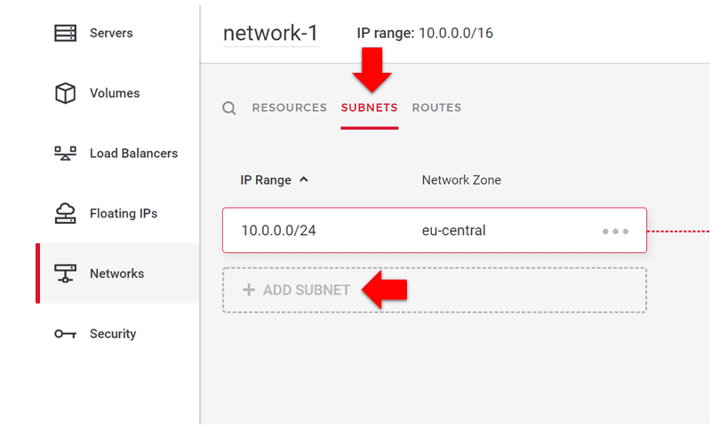
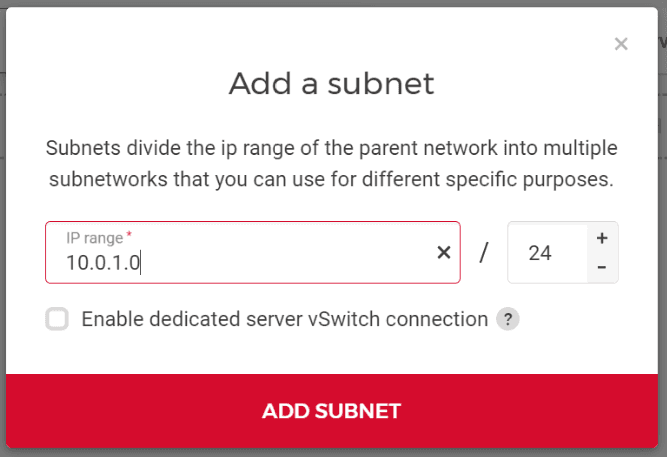
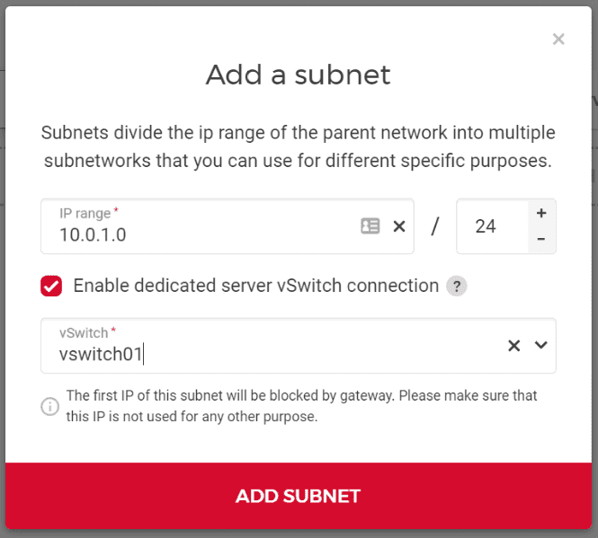

# Hetzner Main Thread: Zero -> HA k3s (VM control planes + physical workers on MicroOS)

This is the single end-to-end path to build a production HA k3s cluster on Hetzner.

- Control planes: Hetzner Cloud VMs with openSUSE MicroOS
- Workers: Hetzner dedicated servers with openSUSE MicroOS (including optional GPU models like GEX44)
- Rancher: separate management cluster (not in this cluster)

## Reality check about screenshots

This environment cannot log in to your Hetzner account, so it cannot capture your exact tenant screens.
I included official Hetzner UI screenshots in this repo:

- `docs/assets/screenshots/hetzner/cloud-add-server-button.png`
- `docs/assets/screenshots/hetzner/cloud-create-server.png`
- `docs/assets/screenshots/hetzner/network-subnets-tab.png`
- `docs/assets/screenshots/hetzner/network-add-subnet-dialog.png`
- `docs/assets/screenshots/hetzner/network-enable-vswitch.png`

## 1) Prepare local workstation (Ubuntu 24.04 Desktop)

All commands below are for Ubuntu 24.04 Desktop.

### 1.1 Install required tools

```bash
sudo apt update
sudo apt -y upgrade
sudo apt -y install ca-certificates curl gnupg lsb-release software-properties-common git jq make unzip openssh-client
```

Terraform:

```bash
curl -fsSL https://apt.releases.hashicorp.com/gpg | sudo gpg --dearmor -o /usr/share/keyrings/hashicorp-archive-keyring.gpg
echo "deb [signed-by=/usr/share/keyrings/hashicorp-archive-keyring.gpg] https://apt.releases.hashicorp.com $(lsb_release -cs) main" | sudo tee /etc/apt/sources.list.d/hashicorp.list
sudo apt update
sudo apt -y install terraform
terraform version
```

Ansible:

```bash
sudo apt -y install ansible
ansible --version
```

kubectl:

```bash
curl -fsSL https://pkgs.k8s.io/core:/stable:/v1.32/deb/Release.key | sudo gpg --dearmor -o /usr/share/keyrings/kubernetes-apt-keyring.gpg
echo 'deb [signed-by=/usr/share/keyrings/kubernetes-apt-keyring.gpg] https://pkgs.k8s.io/core:/stable:/v1.32/deb/ /' | sudo tee /etc/apt/sources.list.d/kubernetes.list
sudo apt update
sudo apt -y install kubectl
kubectl version --client
```

Helm:

```bash
curl -fsSL https://baltocdn.com/helm/signing.asc | sudo gpg --dearmor -o /usr/share/keyrings/helm.gpg
echo "deb [signed-by=/usr/share/keyrings/helm.gpg] https://baltocdn.com/helm/stable/debian/ all main" | sudo tee /etc/apt/sources.list.d/helm-stable-debian.list
sudo apt update
sudo apt -y install helm
helm version
```

### 1.2 Clone repository and generate SSH key

```bash
git clone <your-repo-url>
cd hetzner-k3s-ha-cluster-dedicated-workers
ssh-keygen -t ed25519 -C "k3s-admin" -f ~/.ssh/id_ed25519_k3s
ls -l ~/.ssh/id_ed25519_k3s ~/.ssh/id_ed25519_k3s.pub
```

## 2) Prepare Hetzner project and credentials

### 2.1 Create/select Hetzner Cloud project

1. Open Hetzner Cloud Console.
2. Create/select project for runtime cluster.

### 2.2 Create API token for Terraform

Menu path:
- `Project -> Security -> API Tokens -> Generate API Token`

Store token locally (do not commit):

```bash
mkdir -p ~/.config/hetzner
chmod 700 ~/.config/hetzner
printf '%s\n' 'HCLOUD_TOKEN=<paste-token>' > ~/.config/hetzner/runtime.env
chmod 600 ~/.config/hetzner/runtime.env
```

### 2.3 Upload SSH key to Cloud project

Menu path:
- `Project -> Security -> SSH Keys -> Add SSH Key`

Paste `~/.ssh/id_ed25519_k3s.pub`.

## 3) Prepare Cloud private network + vSwitch

You need one private network reachable by both Cloud VMs and dedicated servers.

### 3.1 Create Cloud network

Menu path:
- `Project -> Networking -> Networks -> Create Network`

Example values:
- Name: `runtime-net`
- Network range: `10.80.0.0/16`

### 3.2 Add subnet

Menu path:
- Open network -> `Subnets` -> `Add Subnet`

Example values:
- Type: `Cloud`
- Network zone: `eu-central`
- Subnet range: `10.80.10.0/24`





### 3.3 Enable vSwitch coupling

Menu path:
- Same network -> `Subnets` -> `Enable vSwitch`



## 4) Create MicroOS VM image for Hetzner Cloud (from scratch)

Hetzner Cloud VM creation in Terraform needs an image name or ID. For MicroOS, create a reusable snapshot first.

### 4.1 Create temporary conversion VM

1. Create temporary Cloud server (small flavor is enough).
2. Any Linux image is fine for temporary conversion host.
3. Attach your SSH key.

### 4.2 Put temporary VM into Rescue mode

Menu path:
- `Servers -> <temp-server> -> Rescue -> Enable rescue and reboot`

SSH to rescue system.

### 4.3 Write MicroOS disk image to VM disk

1. Get latest openSUSE MicroOS image URL from official download location.
2. Download and write image to primary disk (example `/dev/sda`).

Example pattern:

```bash
export MICROOS_IMAGE_URL='<official-microos-image-url>'
curl -L "$MICROOS_IMAGE_URL" -o /tmp/microos.raw.xz
xz -dc /tmp/microos.raw.xz | dd of=/dev/sda bs=16M status=progress conv=fsync
sync
```

3. Disable rescue mode and reboot into MicroOS.

### 4.4 Validate and snapshot

1. SSH to booted MicroOS VM.
2. Verify OS:

```bash
cat /etc/os-release
```

3. In Cloud Console create snapshot from this VM and name it, for example `microos-snapshot`.

This snapshot is now used by Terraform variable `image`.

## 5) Prepare dedicated servers in Robot with MicroOS

### 5.1 Order/select dedicated servers

Recommended minimum for HA worker pool:
- 3 dedicated workers

Optional GPU pool:
- add 1..N GPU servers (e.g. GEX44)

### 5.2 Attach dedicated servers to vSwitch

Robot path:
- `Robot -> Servers -> <server> -> vSwitch`
- attach NIC to target vSwitch
- assign private IP in worker subnet (for example `10.80.10.21`, `10.80.10.22`)

### 5.3 Install MicroOS on physical server (standard node)

Use one of two practical methods:

Method A (recommended when available): remote console + installer ISO
1. Open Robot remote console/KVM for server.
2. Boot openSUSE MicroOS installer media.
3. Install on local disks (RAID1 recommended if 2+ disks).
4. Set hostname (`wrk-ded-01`, ...).
5. Create admin account and inject SSH public key.
6. Reboot into installed system.

Method B (headless automation): rescue + direct disk image write
1. Enable Rescue and SSH in.
2. Download official MicroOS raw image.
3. Write it to target disk with `dd`.
4. Reboot and finish first-boot setup.

After installation, verify:

```bash
cat /etc/os-release
ip a
ping -c 3 <one-control-plane-private-ip>
```

### 5.4 Install MicroOS on physical server with dedicated GPU (e.g. GEX44)

Install MicroOS exactly as in 5.3, then install NVIDIA stack using transactional updates.

On GPU server:

```bash
sudo transactional-update pkg install openSUSE-repos-MicroOS-NVIDIA
sudo reboot
```

After reboot:

```bash
sudo transactional-update pkg install nvidia-open-driver-G06-signed-kmp-meta nvidia-compute-utils-G06 nvidia-container-toolkit
sudo reboot
```

Validate driver and toolkit:

```bash
nvidia-smi
nvidia-ctk --version
```

## 6) Harden MicroOS node access baseline

Apply on all control-plane and worker nodes.

1. Create admin user and grant sudo:

```bash
sudo useradd -m -s /bin/bash ops || true
sudo usermod -aG wheel ops
sudo mkdir -p /home/ops/.ssh
sudo cp /root/.ssh/authorized_keys /home/ops/.ssh/authorized_keys
sudo chown -R ops:users /home/ops/.ssh
sudo chmod 700 /home/ops/.ssh
sudo chmod 600 /home/ops/.ssh/authorized_keys
```

2. Disable password auth and harden SSH root policy:

```bash
sudo sed -i 's/^#\?PasswordAuthentication.*/PasswordAuthentication no/' /etc/ssh/sshd_config
sudo sed -i 's/^#\?PermitRootLogin.*/PermitRootLogin prohibit-password/' /etc/ssh/sshd_config
sudo sshd -t && sudo systemctl restart sshd
```

3. Keep SSH keys only (verify):

```bash
grep -E '^(PermitRootLogin|PasswordAuthentication|PubkeyAuthentication)' /etc/ssh/sshd_config
```

4. Ensure private networking persists (wicked or NetworkManager profile depending on install path).
Reboot once and verify private IP remains.

## 7) Provision control-plane infrastructure (Terraform)

```bash
cd automation/terraform/hetzner
cp terraform.tfvars.example terraform.tfvars
source ~/.config/hetzner/runtime.env
```

Edit `terraform.tfvars`:
- `image = "microos-snapshot"` (or snapshot ID)
- `control_plane_count = 3`
- `control_plane_type = "cpx31"` (example)
- `ssh_public_key_path = "~/.ssh/id_ed25519_k3s.pub"`
- other cluster/network settings

Apply:

```bash
terraform init
terraform plan
terraform apply
```

### 7.1 `api_allowed_cidrs`

Use minimum set of trusted source networks.

Single admin IP:

```hcl
api_allowed_cidrs = [
  "203.0.113.10/32"
]
```

Office + VPN egress:

```hcl
api_allowed_cidrs = [
  "198.51.100.0/24",
  "203.0.113.44/32"
]
```

Temporary open access for bootstrap only (remove immediately after setup):

```hcl
api_allowed_cidrs = [
  "0.0.0.0/0",
  "::/0"
]
```

### 7.2 Collect outputs

```bash
terraform output
terraform output -json > tf-output.json
jq '.control_plane_public_ips' tf-output.json
jq '.control_plane_private_ips' tf-output.json
jq -r '.api_load_balancer_public_ipv4.value' tf-output.json
```

Use them for:
- SSH and inventory host mapping
- private routing verification
- DNS record target for API endpoint

## 8) Create/verify API DNS entry

Create DNS `A` record:
- `k8s-api.<your-domain>` -> Terraform output `api_load_balancer_public_ipv4`

Verify:

```bash
dig +short k8s-api.<your-domain> A
nc -vz k8s-api.<your-domain> 6443
```

After control planes are ready:

```bash
curl -k https://k8s-api.<your-domain>:6443/readyz
```

## 9) Build Ansible inventory

```bash
cd ../../ansible
cp inventories/production/hosts.example.yml inventories/production/hosts.yml
```

Fill:
- `k3s_servers`: MicroOS control-plane VMs
- `k3s_agents`: MicroOS dedicated workers
- GPU workers: `gpu_enabled: true`, labels, taints

## 10) Bootstrap MicroOS baseline

```bash
ansible-playbook -i inventories/production/hosts.yml playbooks/bootstrap-os.yml
```

This playbook applies kernel/sysctl setup and transactional package changes, then reboots MicroOS nodes.

## 11) Join MicroOS nodes as control planes

First control-plane node (cluster-init):

```bash
ansible-playbook -i inventories/production/hosts.yml playbooks/install-k3s-servers.yml --limit runtime-cp-01
```

Remaining control-plane nodes (join to existing control-plane set):

```bash
ansible-playbook -i inventories/production/hosts.yml playbooks/install-k3s-servers.yml --limit 'k3s_servers:!runtime-cp-01'
```

## 12) Join MicroOS nodes as workers

Join all worker nodes:

```bash
ansible-playbook -i inventories/production/hosts.yml playbooks/install-k3s-agents.yml
```

Join a single new worker later:

```bash
ansible-playbook -i inventories/production/hosts.yml playbooks/install-k3s-agents.yml --limit <worker-hostname>
```

## 13) GPU nodes: finish cluster-side setup

Install NVIDIA runtime on GPU workers:

```bash
ansible-playbook -i inventories/production/hosts.yml playbooks/install-nvidia-runtime.yml --limit <gpu-hostname-or-group>
```

Install Kubernetes device plugin:

```bash
kubectl apply -f https://raw.githubusercontent.com/NVIDIA/k8s-device-plugin/v0.17.1/nvidia-device-plugin.yml
kubectl get nodes -o custom-columns=NAME:.metadata.name,GPU:.status.allocatable.nvidia\.com/gpu
```

## 14) Verify cluster health

```bash
kubectl get nodes -o wide
kubectl -n kube-system get pods
kubectl get --raw /readyz?verbose
```

## 15) Terraform and Git policy (per cluster)

Commit to Git:
- all Terraform `.tf` files
- `terraform.tfvars.example`
- docs/runbooks

Never commit:
- `terraform.tfvars`
- `*.tfstate*`
- `.terraform/`
- tokens/secrets

Recommended team setup:
- remote Terraform state backend
- one state per cluster/environment
- commit infra code before apply, never generated state artifacts

## Official references

- Hetzner vSwitch coupling tutorial:
  - https://docs.hetzner.com/networking/networks/tutorials/connect-dedi-vswitch/
- Hetzner Cloud server docs:
  - https://docs.hetzner.com/cloud/servers/getting-started/creating-a-server/
- openSUSE MicroOS portal:
  - https://microos.opensuse.org/
- k3s configuration:
  - https://docs.k3s.io/installation/configuration
